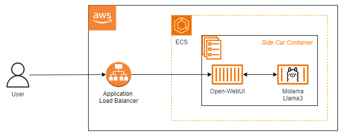
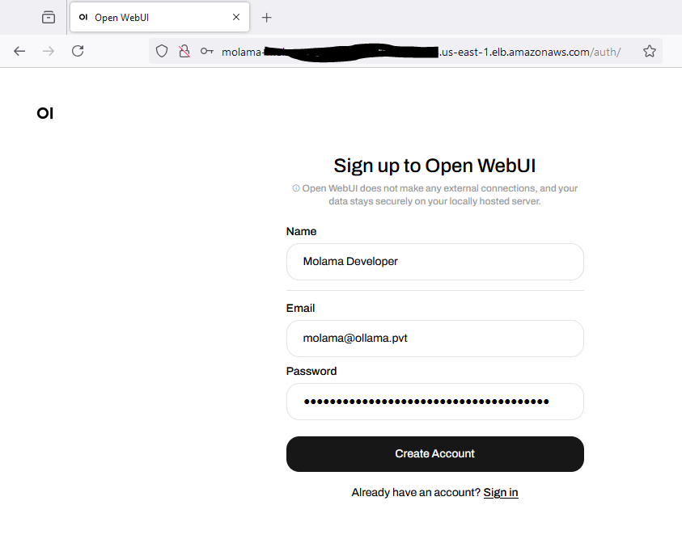
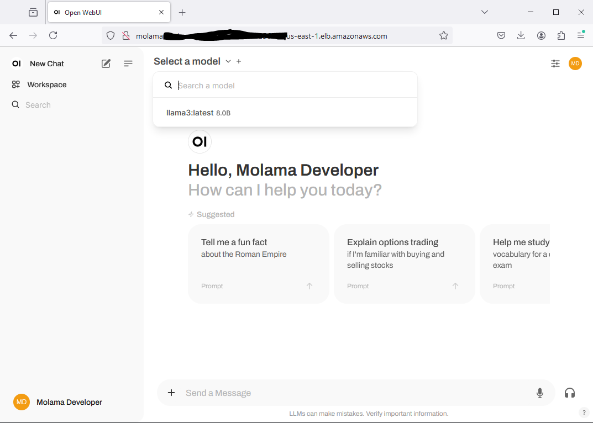
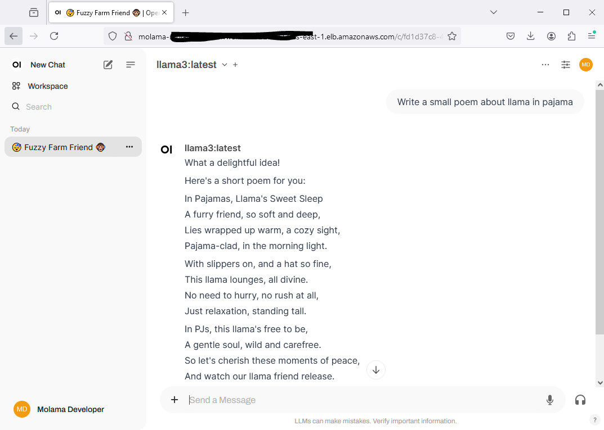

# Run Molama on AWS ECS

Ever heard of [Molama](https://hub.docker.com/r/smislam/molama)?  I created that Docker image to make it simpler to run Ollama with an embeded Model.

In this example we demonstrate deployment of Molama on AWS ECS.  This Molama image includes the Llama3 LLM model embeded within [Ollama](https://ollama.com/).

In addition to Molama, we also use [Open-WebUI](https://openwebui.com) application for model visualization. The Open-WebUi application is exposed using AWS ALB.  These containers are deployed as a Side Car.

This application is developed using AWS CDK in TypeScript.

## Architecture

## What does it build?
* Creates and deploys both Molama and Open-WebUI applications on AWS ECS
* Installs and Configures Open-WebUI application to communicate with Ollama server
* Creates an AWS ALB to expose the Open-WebUI application

## Steps to run and test
* Deploy the CDK code. Wait for the deployment to finish.  It will print out the Website endpoint for you to use.  Sign up.
  * 
* Select the Llama3 Model for use
  * 
* Play with the model
  * 

## References
* [Molama Docker Image](https://hub.docker.com/r/smislam/molama)
* [Ollama](https://ollama.com/)
* [Open Web UI](https://openwebui.com/)

## Additional Guidance
* This POC example is very simple and doesn't include detailed configurations to make neither Molama(Ollama) nor Open-WebUI production ready.  You must update the configurations to make sure this solution is secured and operational.  
* For Volumes, use AWS EFS so that data is persistant
* Setup IdP and TLS for user authentication and encryption in transit